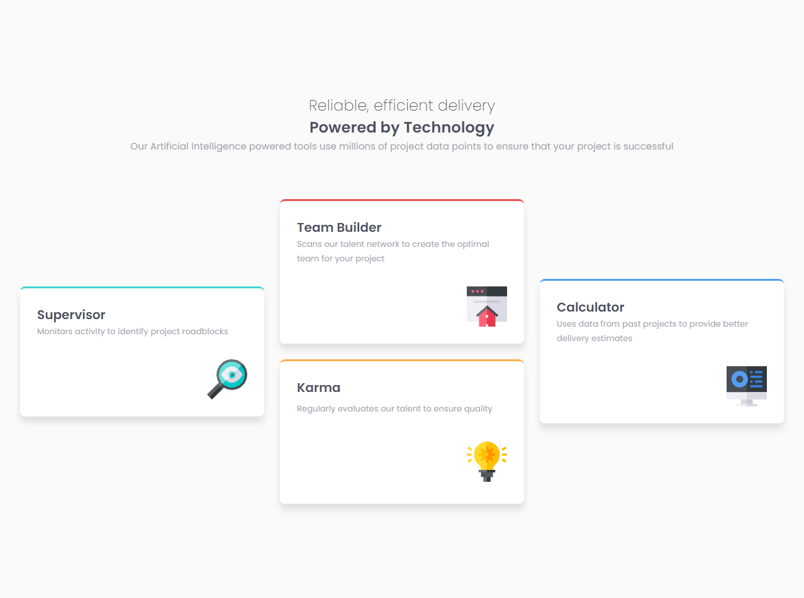

# Frontend Mentor - Four card feature section solution

This is a solution to the [Four card feature section challenge on Frontend Mentor](https://www.frontendmentor.io/challenges/four-card-feature-section-weK1eFYK). Frontend Mentor challenges help you improve your coding skills by building realistic projects. 

## Table of contents

- [Overview](#overview)
  - [The challenge](#the-challenge)
  - [Screenshot](#screenshot)
  - [Links](#links)
- [My process](#my-process)
  - [Built with](#built-with)
  - [What I learned](#what-i-learned)
  - [Continued development](#continued-development)
  - [Useful resources](#useful-resources)
- [Author](#author)

## Overview

### The challenge

Users should be able to:

- View the optimal layout for the site depending on their device's screen size

### Screenshot




### Links

- Solution URL: https://github.com/gianmromero/four-card-feature-section-master
- Live Site URL: https://four-card-feature-section-master-gpbnevzvk.vercel.app/

## My process

### Built with

- Semantic HTML5 markup
- CSS custom properties
- CSS Grid
- Mobile-first workflow

### What I learned

I improved my understading about grid layout and how make a responsive website with it.

This snippet of code give me a lot of knowledge about grid layout and responsiveness:

```html
<h1>Some HTML code I'm proud of</h1>
```
```css
.grid-container {
  grid-template-columns: repeat(3, 1fr);
        grid-template-rows: repeat(2, 1fr);
        grid-template-areas:
        "start center-top end"
        "start center-bottom end";
}
```

### Continued development

I will keep working on grid layout and responsiveness with my projects.

### Useful resources

- [Resource 1](https://www.joshwcomeau.com/css/interactive-guide-to-grid/) - This helped me to understand and apply grid layout on this project.

## Author

- Frontend Mentor - [@gianmromero](https://www.frontendmentor.io/profile/gianmromero)

